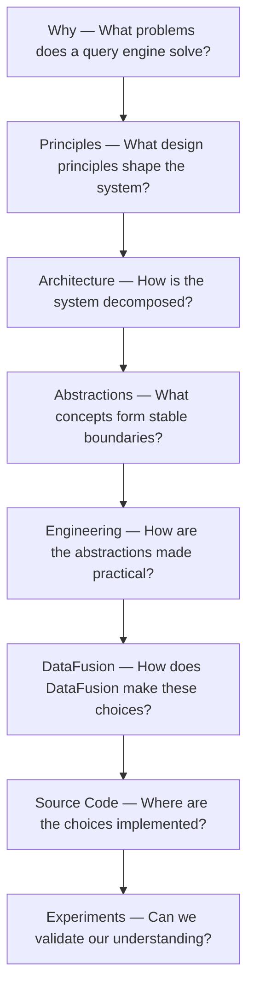

# DataFusion Research

A systematic study of query engine architecture, design philosophy, and engineering practices through Apache DataFusion — from high-level principles to implementation details.

## What this project is about

This repository uses Apache DataFusion as a concrete case study to understand **how query engines are designed**.

The primary goal is not to walk through source code file by file. Instead, we start from architectural problems and design constraints, build a high-level mental model, study the abstractions and engineering trade-offs, and then use DataFusion's implementation and source code to validate that understanding.

## Learning direction



The direction is deliberately **high-level → low-level**:

> problem → principle → architecture → abstraction → engineering → implementation → source code → experiment

## Questions we want to answer

Rather than beginning with “what does this Rust type do?”, we begin with questions such as:

- What are the fundamental responsibilities of a query engine?
- Why do query engines separate logical planning from physical planning?
- Where should the optimizer end and the execution engine begin?
- What makes an operator a useful execution abstraction?
- How should partitioning, parallelism, scheduling, memory, and I/O interact?
- Which boundaries should be extensible, and which invariants should remain internal?
- What engineering trade-offs appear when an elegant architecture meets real workloads?
- Why did DataFusion choose its particular abstractions, and what alternatives exist?

## Research map

### 1. Query Engine Mental Model

Build a technology-independent model first.

```text
SQL / API
   ↓
Parsing & Binding
   ↓
Logical Representation
   ↓
Logical Optimization
   ↓
Physical Planning
   ↓
Physical Optimization
   ↓
Execution
   ↓
Runtime: Scheduling / Memory / I/O / Parallelism
```

Start with [Query Engine Overview](docs/00-query-engine-overview.md).

### 2. Design Philosophy

Study the forces behind the architecture: separation of concerns, extensibility, composability, cost and rule boundaries, streaming, parallelism, resource ownership, and the trade-offs between generality and performance.

See [Design Philosophy](docs/01-design-philosophy.md).

### 3. Architecture

Map responsibilities into subsystems and study their boundaries before looking at implementation details.

See [Architecture](docs/02-architecture.md).

### 4. Core Abstractions

Identify the abstractions that carry architectural intent across the system: plans, expressions, schemas, execution operators, streams, partitions, contexts, optimizer rules, and related contracts.

See [Core Abstractions](docs/03-core-abstractions.md).

## How source code is used

Source code is evidence, not the starting point.

When reading an implementation, the preferred sequence is:

```text
Architectural question
        ↓
General design space
        ↓
DataFusion's choice
        ↓
Core abstraction
        ↓
Implementation
        ↓
Source code
        ↓
Experiment / verification
```

Source-oriented findings belong in [source-notes](source-notes/README.md). Small executable investigations and benchmarks belong in [experiments](experiments/README.md). Raw observations that have not yet matured into structured research belong in [notes](notes/README.md).

## Current phase

**Phase 0 — Build the mental model.**

The first research task is:

> **How should a query engine be designed?**

Before studying DataFusion-specific internals, we will establish the major responsibilities, data/control flow, architectural boundaries, and design tensions of a modern analytical query engine.

## Repository structure

```text
datafusion-research/
├── README.md
├── docs/
│   ├── 00-query-engine-overview.md
│   ├── 01-design-philosophy.md
│   ├── 02-architecture.md
│   └── 03-core-abstractions.md
├── notes/
│   └── README.md
├── experiments/
│   └── README.md
└── source-notes/
    └── README.md
```

## Guiding principle

The project should eventually make it possible to answer a harder question than “how does DataFusion work?”:

> **If we had to design a query engine ourselves, what problems would we encounter, what design space would we have, and how would we reason about the trade-offs?**
